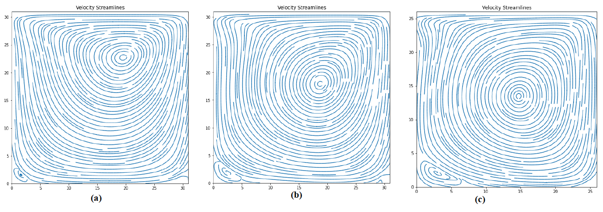

# 🌊 2D Incompressible Navier-Stokes Solver — Lid-Driven Cavity (SIMPLE Algorithm)

[](https://www.python.org/)
[](LICENSE)
[](#)

A Python-based 2D incompressible Navier-Stokes solver for the classical **Lid-Driven Cavity** problem using the **SIMPLE Algorithm**, **Rhie-Chow Interpolation** on a collocated mesh grid, and the **Upwind Scheme** for advection-diffusion.

> **Course:** MIE1210 — University of Toronto, Mechanical & Industrial Engineering  
> **Author:** Vasanth Ravin Vincent Paula

---

## Table of Contents

- [Introduction](#introduction)
- [Problem Statement](#problem-statement)
- [Governing Equations](#governing-equations)
- [Numerical Methodology](#numerical-methodology)
  - [Non-Dimensional Form](#non-dimensional-form)
  - [Discretization](#discretization)
  - [The SIMPLE Algorithm](#the-simple-algorithm)
  - [Upwind Scheme](#upwind-scheme)
  - [Pressure–Velocity Coupling](#pressurevelocity-coupling)
  - [Rhie-Chow Interpolation (PWIM)](#rhie-chow-interpolation-pwim)
  - [Updating Pressures and Velocities](#updating-pressures-and-velocities)
  - [GMRES Solver](#gmres-solver)
- [Results and Discussion](#results-and-discussion)
- [Validation](#validation)
- [Grid Convergence](#grid-convergence)
- [Tech Stack](#tech-stack)
- [Usage](#usage)
- [References](#references)

---

## Introduction

The **Navier-Stokes equations** represent the dynamics of a viscous fluid in a set of partial differential equations, developed by Claude-Louis Navier and George Gabriel Stokes over the years 1822–1850. They are based on the conservation of momentum, energy, and mass for a Newtonian fluid. While extremely accurate for laminar flows, solving them analytically is generally intractable — hence the need for numerical methods.

This project uses the **Finite Volume Method (FVM)** to discretize the equations and solves them using the **Semi-Implicit Method for Pressure-Linked Equations (SIMPLE)**. The study is limited to **laminar flow** only.

### Reynolds Number

The Reynolds number measures the ratio of inertia forces to viscous forces:

$$
Re = \frac{\rho U L}{\mu}
$$

As a general rule:
- **Re < 2000** → Laminar
- **2000 < Re < 3500** → Transitional
- **Re > 3500** → Turbulent

---

## Problem Statement

The **Lid-Driven Cavity** is a classical CFD benchmark problem. It consists of a square domain with the following Dirichlet boundary conditions:

| Boundary | Condition |
|----------|-----------|
| Top wall (lid) | $u = U$, $v = 0$ |
| Bottom wall | $u = 0$, $v = 0$ |
| Left wall | $u = 0$, $v = 0$ |
| Right wall | $u = 0$, $v = 0$ |


*Fig. 1 — Boundary conditions for the lid-driven cavity problem.*

---

## Governing Equations

For a **steady-state**, **incompressible** fluid flow, the Navier-Stokes equations are:

### X-Momentum

$$
\frac{\partial}{\partial x}(\rho u u) + \frac{\partial}{\partial y}(\rho v u) = \frac{\partial}{\partial x}\left(\mu \frac{\partial u}{\partial x}\right) + \frac{\partial}{\partial y}\left(\mu \frac{\partial u}{\partial y}\right) - \frac{\partial P}{\partial x} + S_u \tag{1}
$$

### Y-Momentum

$$
\frac{\partial}{\partial x}(\rho v u) + \frac{\partial}{\partial y}(\rho v v) = \frac{\partial}{\partial x}\left(\mu \frac{\partial v}{\partial x}\right) + \frac{\partial}{\partial y}\left(\mu \frac{\partial v}{\partial y}\right) - \frac{\partial P}{\partial y} + S_v \tag{2}
$$

### Continuity (Mass Conservation)

$$
\frac{\partial}{\partial x}(\rho u) + \frac{\partial}{\partial y}(\rho v) = 0 \tag{3}
$$

> **Challenge:** The continuity equation (Eq. 3) is independent of the pressure variable, which gives rise to the need for a coupled pressure-velocity system.

---

## Numerical Methodology

The **Finite Volume Method (FVM)** transforms PDEs representing conservation laws over differential volumes into discrete algebraic equations over finite volumes. Volume integrals are converted to surface integrals via the **Gauss Divergence Theorem**:

$$
\oint_V (\nabla \cdot \vec{a})\, dV = \oint_S \vec{a} \cdot \hat{n}\, dS \tag{4}
$$

The flux entering a control volume equals the flux leaving it, making FVM inherently conservative.

### Indexing Convention


*Fig. 2 — Indexing used for the control volume. `(i, j)` = P (centre), with E, W, N, S neighbours.*

### Control Volume


*Fig. 3 — A sample control volume with the nodes and face velocities.*

---

### Non-Dimensional Form

Using the non-dimensional variables:

$$
u^* = \frac{u}{U}, \quad v^* = \frac{v}{U}, \quad x^* = \frac{x}{L}, \quad y^* = \frac{y}{L}, \quad \nabla^* = L\nabla
$$

The **non-dimensionalized continuity equation**:

$$
\nabla^* \cdot \vec{u}^* = 0 \tag{7}
$$

The **non-dimensionalized momentum equation**:

$$
\nabla^* \cdot \vec{u}^* \vec{u}^* = -\nabla^* p^* + \frac{1}{Re} \nabla^{*2} \cdot \vec{u}^* \tag{8}
$$

---

### Discretization

The pressure gradient at node P along the x-axis:

$$
-\frac{\partial P}{\partial x}\bigg|_P = \frac{-p_e - p_w}{\Delta x} \tag{9}
$$

By interpolation:

$$
p_e = \frac{p_P + p_E}{2}, \quad p_w = \frac{p_P + p_W}{2} \tag{10}
$$

Substituting:

$$
-\frac{\partial P}{\partial x}\bigg|_P = \frac{-p_E - p_W}{2\Delta x} \tag{11}
$$

**Discretized u-momentum equation:**

$$
a_P u_P = \sum_{nb} a_{nb} u_{nb} + S_u + (p_w - p_e)\Delta y \tag{12}
$$

**Discretized v-momentum equation:**

$$
a_P v_P = \sum_{nb} a_{nb} v_{nb} + S_v + (p_s - p_n)\Delta x \tag{13}
$$

**Discretized continuity equation (steady-state):**

$$
[(\rho u)_e - (\rho u)_w]\Delta y + [(\rho v)_n - (\rho v)_s]\Delta x = 0 \tag{15}
$$

---

### The SIMPLE Algorithm

The **SIMPLE** (Semi-Implicit Method for Pressure-Linked Equations) algorithm was developed by **Suhas Patankar and Brian Spalding** in the early 1970s.


*Fig. 4 — Flowchart of the SIMPLE algorithm.*

**Key characteristics:**
- Simple and computationally efficient for N-S equations
- Fast convergence for laminar problems
- Good velocity corrections, but pressure corrections can be large
- Requires **under-relaxation** for stability

**Under-relaxation factors used:**
| Parameter | Factor |
|-----------|--------|
| Pressure correction ($\alpha_p$) | 0.7 |
| Velocity correction ($\alpha_{uv}$) | 0.2 |

---

### Upwind Scheme

The **Upwind Scheme** evaluates the link-coefficients of the momentum equations by considering the upstream control volume value depending on flow direction.

For the 2D diffusion-convection equation:

$$
\frac{d}{dx}(\rho u \phi) + \frac{d}{dy}(\rho v \phi) = \frac{d}{dx}\left(\Gamma \frac{d\phi}{dx}\right) + \frac{d}{dy}\left(\Gamma \frac{d\phi}{dy}\right) \tag{16}
$$

where $F_x = (\rho u)_x$ and $D_x = \frac{\Gamma}{dx}$.

**Upwind direction logic:**

| Condition | East face | West face |
|-----------|-----------|-----------|
| $\vec{u} > 0$ | $\phi_e = \phi_P$ | $\phi_w = \phi_W$ |
| $\vec{u} < 0$ | $\phi_e = \phi_E$ | $\phi_w = \phi_P$ |

**Link coefficients:**

$$
\begin{aligned}
a_E &= D_e + \max(0, -F_e) \\
a_W &= D_w + \max(F_w, 0) \\
a_N &= D_n + \max(0, -F_n) \\
a_S &= D_s + \max(F_s, 0) \\
a_P &= a_E + a_W + a_N + a_S
\end{aligned}
\tag{18}
$$

where $\phi = (u, v)$.

---

### Pressure–Velocity Coupling

From the continuity equation, the **pressure-correction equation** is derived:

$$
a_P p'_P + a_E p'_E + a_N p'_N + a_W p'_W + a_S p'_S = S_p
$$

**Link coefficients for pressure correction:**

$$
\begin{aligned}
a_E &= \frac{-\rho_e (\Delta y)^2}{2}\left[\frac{1}{a_P|_E} + \frac{1}{a_P|_P}\right] \\[6pt]
a_W &= \frac{-\rho_w (\Delta y)^2}{2}\left[\frac{1}{a_P|_W} + \frac{1}{a_P|_P}\right] \\[6pt]
a_N &= \frac{-\rho_n (\Delta x)^2}{2}\left[\frac{1}{a_P|_N} + \frac{1}{a_P|_P}\right] \\[6pt]
a_S &= \frac{-\rho_s (\Delta x)^2}{2}\left[\frac{1}{a_P|_S} + \frac{1}{a_P|_P}\right] \\[6pt]
a_P &= a_E + a_W + a_N + a_S
\end{aligned}
\tag{19}
$$

**Source term (mass imbalance):**

$$
S_p = \left[(\rho_e \hat{u}_e - \rho_w \hat{u}_w)\Delta y + (\rho_n \hat{v}_n - \rho_s \hat{v}_s)\Delta x\right] = -\dot{m} \tag{20}
$$

---

### Rhie-Chow Interpolation (PWIM)

Normal interpolation of face velocities leads to **checkerboard pressure oscillations**. The **Rhie-Chow interpolation** (or Pressure-Weighted Interpolation Method) avoids this by using momentum-based interpolation for cell face mass fluxes.


*Fig. 5 — Imaginary control volume with 'e' as the centre.*

**Momentum equations at nodes P, E, and face e:**

$$
\hat{u}_P = -\frac{1}{a_P|_P}\sum_{nb} a_{nb}|_P \hat{u}_{nb}|_P + \frac{(p^{(k)}_W - p^{(k)}_E)}{2a_P|_P}\Delta y \tag{21}
$$

$$
\hat{u}_E = -\frac{1}{a_P|_E}\sum_{nb} a_{nb}|_E \hat{u}_{nb}|_E + \frac{(p^{(k)}_P - p^{(k)}_{EE})}{2a_P|_E}\Delta y \tag{22}
$$

**Approximation for face coefficient:**

$$
\frac{1}{a_P|_e} = \frac{1}{2}\left[\frac{1}{a_P|_E} + \frac{1}{a_P|_P}\right] \tag{24}
$$

**The PWIM formula:**

$$
\hat{u}_e = \frac{\hat{u}_P + \hat{u}_E}{2} + \frac{\Delta x \Delta y}{2}\left[\frac{1}{a_P|_P}\frac{\partial p^{(k)}}{\partial x}\bigg|_P + \frac{1}{a_P|_E}\frac{\partial p^{(k)}}{\partial x}\bigg|_E - \left(\frac{1}{a_P|_E} + \frac{1}{a_P|_P}\right)\frac{\partial p^{(k)}}{\partial x}\bigg|_e\right] \tag{27}
$$

---

### Updating Pressures and Velocities

**Pressure correction:**

$$
p_P^{(k+1)} = p_P + \alpha_p \, p'_P \tag{27}
$$

**Centre-velocity correction:**

$$
u_P^{(k+1)} = \hat{u}_P + \alpha_{uv}\left(\frac{p'_W - p'_E}{2a_P|_P}\right)\Delta y \tag{28}
$$

**Face-velocity correction:**

$$
u_e^{(k+1)} = \hat{u}_e + \alpha_{uv}\left(\frac{1}{a_P|_E} + \frac{1}{a_P|_P}\right)\left(\frac{p'_W - p'_E}{2}\right)\Delta y \tag{29}
$$

---

### GMRES Solver

The **GMRES** (Generalized Minimal Residual Method) iterative solver is used for solving the linear systems:

$$
Ax = \vec{b} \tag{30}
$$

With a left-preconditioner $M$:

$$
M^{-1}A\vec{x} = M^{-1}\vec{b} \tag{31}
$$

**Convergence criteria:**

| Variable | Error Tolerance |
|----------|----------------|
| Velocities ($u$, $v$) | $10^{-3}$ |
| Pressure ($p$) | $10^{-4}$ |

Error is monitored via the **Squared Error** using the $l_2$-norm:

$$
SE = \sum_{1}^{N} \|y_n - x_n\|^2 \tag{33}
$$

---

## Results and Discussion

Simulations were carried out on a **30×30 mesh grid** at **Re = 100** (unless otherwise specified), using Python 3 on an octa-core Xeon-W processor.

### U-Velocity Contours


*Fig. 6 — Contour plot of the u-velocity (Re = 100, 30×30 grid).*

Maximum u-velocity is observed along the lid (north boundary). The horizontal velocity rapidly decreases toward the centre of the domain near the eye of the primary vortex.

### V-Velocity Contours


*Fig. 7 — Contour plot of the v-velocity.*

Maximum vertical velocity is at the top-left corner (where the fixed left wall meets the moving lid), and minimum is at the top-right corner.

### Pressure Contours


*Fig. 8 — Contour plot of the pressure.*

Maximum pressure occurs at the north-east corner (where velocity terminates) and minimum at the north-west corner (vacuum-like effect where velocity originates).

### Pressure with Velocity Vectors


*Fig. 9 — Contour plot of pressure with velocity vectors overlaid.*

### Velocity Streamlines


*Fig. 10 — Velocity streamlines for (a) Re=100, (b) Re=500, (c) Re=2500.*

Key observations:
- The **primary vortex** moves towards the centre of the cavity as Re increases
- **Secondary vortices** become more dominant as the flow transitions from laminar

---

## Validation

### Comparison with Ghia et al. (1982)

The benchmark study by Ghia et al. on a **257×257 mesh grid** is used for comparison. Our solver uses a **30×30 mesh**, which accounts for the differences.

#### U-Velocity along Vertical Centreline


*Fig. 11 — U-velocity along the centre for Re = 100. Comparison with Ghia et al.*

**Accuracy: ~70%** — the u-velocity profile matches the expected trend (starts at 0, slight negative slope until midpoint, rapid increase to lid velocity at the north boundary).

#### V-Velocity along Horizontal Centreline


*Fig. 12 — V-velocity along the centre for Re = 100. Comparison with Ghia et al.*

**Accuracy: ~60%** — the v-velocity starts at 0, increases until the 1st quarter, decreases until the last quarter, then returns to 0.

### Comparison with ANSYS Fluent


*Fig. 13 — Flow streamlines from ANSYS Fluent for the lid-driven cavity.*


*Fig. 14 — Flow streamlines from ANSYS Fluent for the lid-driven cavity with a square step.*


*Fig. 15 — Flow streamlines from ANSYS Fluent for flow with a backward-facing step.*

ANSYS Fluent shows secondary vortices at both the bottom-right and bottom-left of the cavity. Due to solver accuracy limitations, the bottom-right secondary vortex is not captured in our Python solver.

---

## Grid Convergence

The solver was tested on mesh sizes of **N=10**, **N=20**, and **N=30**. For all three resolutions across 200 iterations, no significant change in velocity results was observed — indicating that the solutions are sufficiently resolved for the iteration count used.

> **Note:** The code is currently incapable of solving higher resolutions efficiently due to solver limitations.

---

## Tech Stack

| Component | Tool |
|-----------|------|
| Language | Python 3 |
| Numerical computation | NumPy, SciPy |
| Linear solver | SciPy GMRES |
| Visualization | Matplotlib |
| IDE | Jupyter Notebook |
| Validation | ANSYS Fluent |

---

## Usage

```bash
# Clone the repository
git clone https://github.com/<your-username>/lid-driven-cavity-simple.git
cd lid-driven-cavity-simple

# Install dependencies
pip install numpy scipy matplotlib jupyter

# Run the solver
jupyter notebook CFDLid_Driven_Cavity_SIMPLE_VasanthRavin.ipynb
```

### Parameters you can modify

| Parameter | Default | Description |
|-----------|---------|-------------|
| `Re` | 100 | Reynolds number |
| `N` | 30 | Grid size (N×N) |
| `alpha_p` | 0.7 | Pressure under-relaxation |
| `alpha_uv` | 0.2 | Velocity under-relaxation |
| `tol_vel` | 0.001 | Velocity convergence tolerance |
| `tol_pres` | 0.0001 | Pressure convergence tolerance |

---

## Conclusion

- Successfully derived the **non-dimensional** form of the N-S equations and discretized them per control volume
- Implemented the **SIMPLE Algorithm** with the **Upwind Scheme** for advection-diffusion
- Applied the **Rhie-Chow method (PWIM)** for pressure-velocity coupling on a collocated grid
- Results show good qualitative agreement with Ghia et al. and ANSYS Fluent
- Primary limitation: solver efficiency on larger mesh grids — can be improved with optimized linear algebra solvers and better under-relaxation strategies

---

## References

1. Rehm, B. et al. (2008). *Situational Problems in MPD.* Managed Pressure Drilling, Gulf Publishing Company.
2. Ghia, U., Ghia, K.N., & Shin, C.T. (1982). *High-Re Solutions for Incompressible Flow Using the Navier-Stokes Equations and a Multigrid Method.* Journal of Computational Physics, 48, 387–411.
3. Versteeg, H.K. & Malalasekera, W. (2007). *An Introduction to Computational Fluid Dynamics: The Finite Volume Method.* Pearson Education.
4. Patankar, S.V. (1980). *Numerical Heat Transfer and Fluid Flow.* Hemisphere Publishing.
5. Moukalled, F., Mangani, L., & Darwish, M. (2015). *The Finite Volume Method in Computational Fluid Dynamics.* Springer.
6. Patankar, S.V. & Spalding, D.B. (1972). *A Calculation Procedure for Heat, Mass and Momentum Transfer in Three-Dimensional Parabolic Flows.* Int. J. Heat Mass Transfer, 15, 1787–1806.
7. Koren, B. (1989). *Upwind Schemes for the Navier-Stokes Equations.*
8. Rhie, C.M. & Chow, W.L. (1983). *Numerical Study of the Turbulent Flow Past an Airfoil with Trailing Edge Separation.* AIAA Journal, 21(11).
9. Zhang, S. & Zhao, X. *General Formulations for Rhie-Chow Interpolation.*
10. Zhang, S.J. et al. (2002). *Effects of Differencing Schemes on Simulation of Dense Gas-Particle Two-Phase Flows.* ICCFD, University of Sydney.
11. Shen, W.Z., Michelsen, J.A. & Sørensen, J.N. (2001). *Improved Rhie-Chow Interpolation for Unsteady Flow Computations.* AIAA Journal, 39(12), 2406–2409.
12. Majumdar, S. (1988). *Role of Underrelaxation in Momentum Interpolation for Calculation of Flow with Non-staggered Grids.* Numerical Heat Transfer, 13, 125–132.
13. Saad, Y. (2003). *Iterative Methods for Sparse Linear Systems* (2nd ed.). SIAM.

---

## Image Placeholders

Create an `images/` directory in the repo and upload the following files:

| Filename | Description |
|----------|-------------|
| `fig1_boundary_conditions.png` | Boundary conditions diagram |
| `fig2_indexing.png` | Control volume indexing scheme |
| `fig3_control_volume.png` | Sample control volume with nodes and face velocities |
| `fig4_simple_flowchart.png` | SIMPLE algorithm flowchart |
| `fig5_imaginary_cv.png` | Imaginary control volume with 'e' as centre |
| `fig6_u_velocity_contour.png` | U-velocity contour plot |
| `fig7_v_velocity_contour.png` | V-velocity contour plot |
| `fig8_pressure_contour.png` | Pressure contour plot |
| `fig9_pressure_velocity_vectors.png` | Pressure contour with velocity vectors |
| `fig10_streamlines.png` | Velocity streamlines (Re=100, 500, 2500) |
| `fig11_u_velocity_centreline.png` | U-velocity vs Ghia et al. comparison |
| `fig12_v_velocity_centreline.png` | V-velocity vs Ghia et al. comparison |
| `fig13_fluent_cavity.png` | ANSYS Fluent lid-driven cavity |
| `fig14_fluent_square_step.png` | ANSYS Fluent cavity with square step |
| `fig15_fluent_backward_step.png` | ANSYS Fluent backward-facing step |

---

<p align="center">
  Made with ☕ and CFD
</p>
